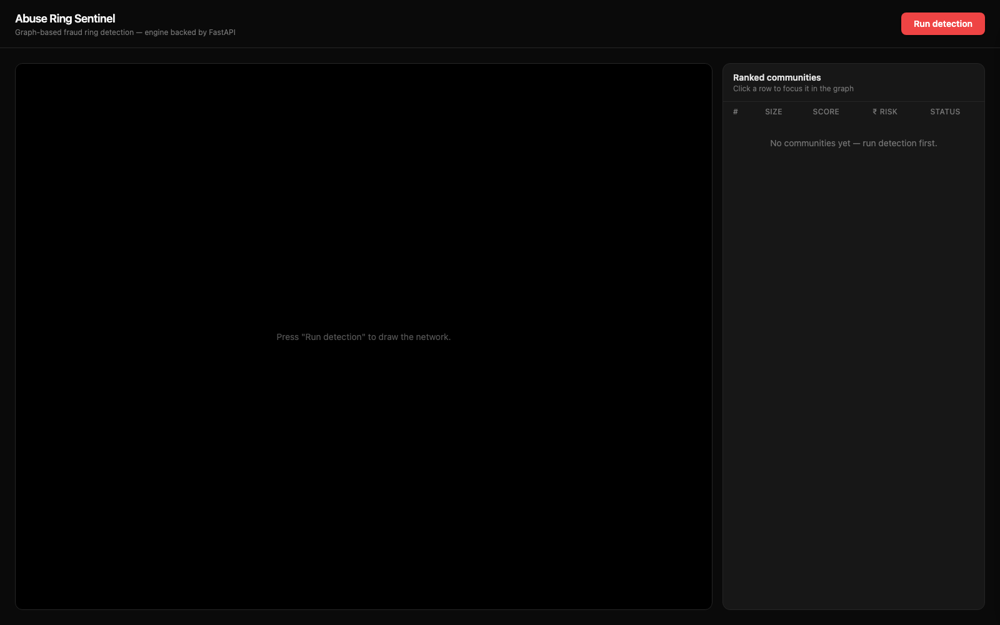
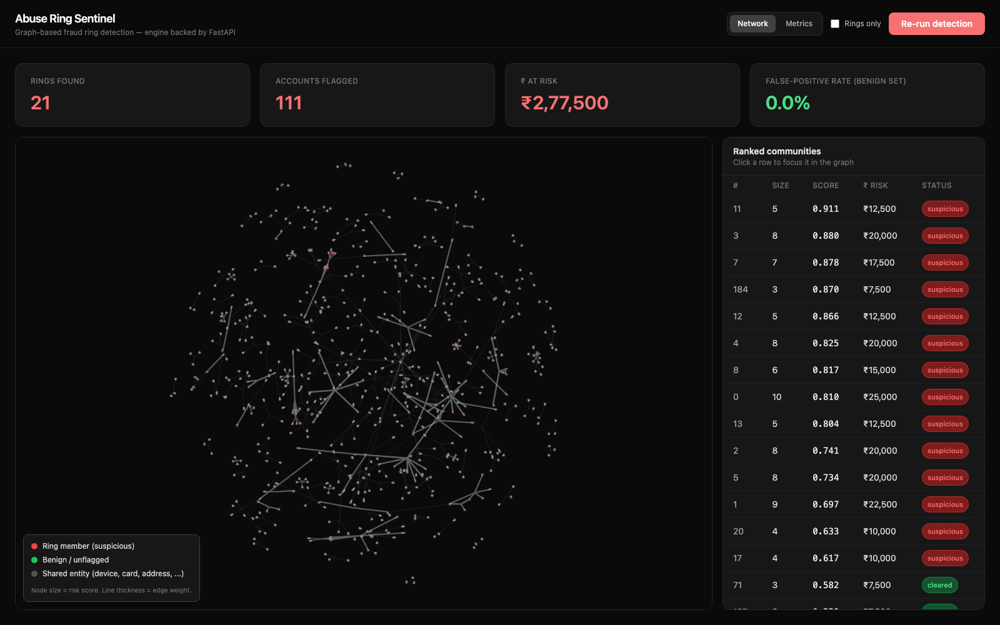
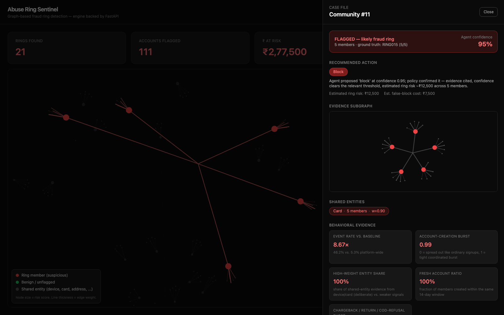
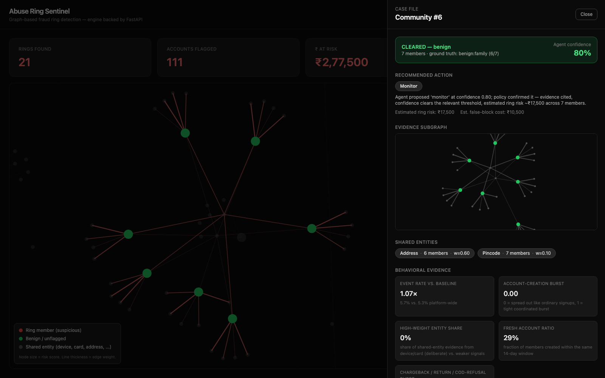
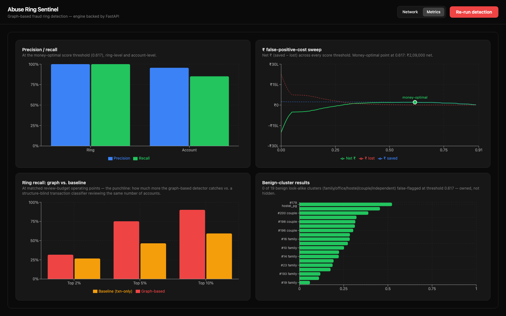

# Abuse Ring Sentinel

Detect coordinated fraud rings in e-commerce using a heterogeneous graph, community detection,
and an LLM agent investigator — with a React + FastAPI dashboard on top. Strictly defense-only.

**Status: complete.** Part A (Stages 1-9, the detection engine) and Part B (Stages 10-13, the
FastAPI + React web app) are both built, wired together, and verified live in a real browser
against a real LLM. See [PLAN.md](PLAN.md) for the full design and staged build plan, and
`docs/` for a stage-by-stage write-up of what was built, what broke, and why.

## Overview

A single fraudster is easy to catch; the expensive damage comes from coordinated
**rings** — accounts that look independent but secretly share a device, card, or address,
and together abuse returns, chargebacks, COD refusals, and promo codes. A
per-transaction fraud model looks at one order at a time and structurally cannot see
this — each order in a ring looks normal in isolation. This project instead builds a
**heterogeneous graph** of customers and the identity signals they share, finds
tightly-connected **communities**, and scores each community for ring-likelihood using
features that separate deliberate coordination from innocent co-location (a family
sharing an address, an office sharing WiFi, a hostel sharing a pincode — the "honesty
traps"). A suspicious community is then handed to an **LLM agent investigator** that
gathers its own evidence via tool calls, actively rules out the same benign explanations,
and proposes a verdict + action — which a separate, non-LLM **cost-aware policy** layer
can only ever downgrade, never upgrade, before anything is acted on. A React dashboard
sits on top so the whole pipeline can be watched, clicked through, and explored rather than
read off a terminal.

Headline result: on the synthetic dataset, the hand-crafted Stage 5 scorer separates all 14
recoverable injected rings from every benign look-alike cluster with a real margin (worst ring
rank 14, best benign rank 15, out of 201 scored communities). Stage 8's full eval confirms this
holds at the account level too: **net ₹209,000** saved at the money-optimal threshold, ring-level
precision/recall/F1 all **1.000**, and **zero** false positives across all 19 benign look-alike
communities at that threshold — see Metrics below. A Stage 6 GNN anomaly layer was also built and
evaluated, and found to *hurt* recall at the operating point that matters, so it ships disabled.

## How to run

You need **two terminals** running at once: the FastAPI backend and the React dev server. The
backend must be started first (or at least before the frontend's first "Run detection" click).

### 1. One-time setup

```
make setup        # create .venv, install Python dependencies
make web-install   # cd web && npm install
```

Copy `.env.example` to `.env` at the repo root and add your `OPENAI_API_KEY` — needed the first
time any given community is investigated (already-investigated communities, e.g. from a prior
`make demo` run, are cached on disk and don't need a live key to re-view).

### 2. Generate data and build the engine's static artifacts (once)

```
make data       # generate synthetic customers/orders/events + ground truth
make resolve    # fuzzy entity resolution (addresses/phones/devices/cards/IPs)
make graph      # build the heterogeneous weighted graph
```

(`make detect`, `make investigate`, `make eval`, `make demo` are also available standalone — see
below — but the web app's own "Run detection" button already re-runs community detection +
scoring live, so you don't need to run `make detect` separately just to use the UI.)

### 3. Start the backend (terminal 1)

```
make api
```

Starts `uvicorn api.main:app --reload` on **http://localhost:8000**. Swagger docs at
`/docs`. CORS is already configured for the Vite dev server's default port.

### 4. Start the frontend (terminal 2)

```
make web
```

Starts the Vite dev server on **http://localhost:5173**. Open that URL in a browser.

### 5. Use it

Click **Run detection**. See the [Demo flow](#demo-flow-what-to-click) section below for the full
walkthrough.

### Engine-only commands (no web app)

```
make detect       # community detection + baseline classifier + ring-likelihood scoring
make gnn-eval      # Stage 6: GNN-fused vs Stage-5-only ring recall at equal FP rate
make investigate   # agent investigator produces case files per suspicious community
make eval          # metrics, ₹ cost sweep, baseline comparison -> eval/report.md
make demo          # full engine run + evidence-subgraph PNG, from the terminal only
```

## Demo flow (what to click)

This is the exact walkthrough behind [PLAN.md §B7](PLAN.md), useful as a script if you're
screen-recording it:

1. **Land on the dashboard.** Nothing has run yet — an explicit empty state ("Press 'Run
   detection' to draw the network") rather than a blank screen.

   

2. **Click "Run detection."** The button shows `Running detection…` then `Loading results…`
   while the backend builds the graph, detects communities, and scores them (a few seconds on
   this dataset). The network graph fades in and its force simulation settles into place —
   the "network forming" effect — then the camera auto-zooms to fit. Summary cards fill in:
   rings found, accounts flagged, ₹ at risk, and the benign-set false-positive rate.

   

3. **Click the top-ranked ring** in the "Ranked communities" table (or click any red node
   directly in the graph). The graph dims everything outside that community and zooms in on
   just its members plus the shared entity (device/card/etc.) tying them together — the
   dim-on-select behavior. A case-file panel slides in from the right.

   

4. **Read the case file.** A red "FLAGGED — likely fraud ring" banner with the agent's
   confidence, the bounded action it was given (e.g. `Block`), a small rendered evidence
   subgraph, the shared-entity chips (device/card shown in red — deliberate, rare signals — vs.
   phone/address/pincode in neutral grey — common, weak signals), four behavioral stat tiles
   (event-rate ratio, account-creation burst, high-weight-entity share, fresh-account ratio),
   and the agent's own reasoning as a readable paragraph (long responses collapse behind a
   "Show more" toggle) followed by its cited evidence and the benign explanations it explicitly
   ruled out.

   

5. **Close the panel and click a benign family** in the table (a `cleared` status chip, ground
   truth `benign:family`). Its nodes are green in the graph, not red. Its case file shows a
   green "CLEARED — benign" banner, a `Monitor` action, and calm reasoning: only an
   address/pincode is shared (weak signal), no device/card reuse, no account-creation burst, and
   an event rate barely above baseline — the agent explicitly names the family explanation and
   rules out "ring."

   

6. **Switch to the "Metrics" tab.** Four charts: ring-level vs. account-level precision/recall,
   the ₹ cost-sweep curve with the money-optimal threshold marked, the graph-vs-baseline ring
   recall bars at matched review budgets (the punchline — this project's whole reason to use a
   graph instead of a per-transaction model), and every benign look-alike cluster's score
   (green = correctly cleared, red = an owned false positive).

   

**One honest wrinkle worth knowing before you record:** the agent isn't perfectly consistent on
the single most ambiguous benign community in this dataset (community #71, a 3-person
"independent" cluster with partial card sharing) — different real LLM calls have flagged it
differently across runs (documented in Stage 9 and in Metrics below). If you click that specific
row and see it flagged, that's a real, previously-documented finding, not a bug — pick a
different `cleared` row (e.g. a `family`/`office_cluster`/`hostel_pg` one) for a clean recording,
or click "Re-run detection" to get a fresh set of cached case files.

## Architecture

### Engine (Part A)

```
  ┌──────────────────────┐
  │ data/ synthetic       │  customers, orders, devices, addresses, cards, phones, IPs,
  │  + ground_truth       │  chargebacks/returns/COD; labels: which accounts = which ring
  └──────────┬───────────┘
             ▼
  ┌──────────────────────┐   fuzzy match: addresses, phones, devices, IP-subnets
  │  ENTITY RESOLUTION    │──▶ canonical entity ids
  └──────────┬───────────┘
             ▼
  ┌──────────────────────┐   nodes: customer/device/address/card/phone/ip
  │  GRAPH BUILDER        │   edges: typed + weighted by discriminativeness
  └──────────┬───────────┘
             ▼
  ┌──────────────────────┐        ┌───────────────────────────┐
  │ COMMUNITY DETECTION   │        │  BASELINE (per-txn         │
  │ Leiden (weighted)     │        │  classifier) — for the     │
  │                       │        │  head-to-head comparison   │
  └──────────┬───────────┘        └───────────────────────────┘
             ▼
  ┌──────────────────────┐   features: sharing depth, chargeback density, timing burst,
  │ RING-LIKELIHOOD SCORER│   account-age pattern, edge-weight mass, GNN embedding (opt, off)
  └──────────┬───────────┘
             ▼
  ┌──────────────────────────────────────────────┐
  │  AGENT INVESTIGATOR (LLM)                       │
  │  per suspicious community:                      │
  │   1 pull evidence subgraph (tools over graph)   │
  │   2 reason: ring vs benign co-location          │
  │   3 bounded action: monitor/hold/review/block   │
  │   4 write an auditable case file + confidence   │
  └──────────┬─────────────────────────────────────┘
             ▼
  ┌──────────────────────────────────────────────┐
  │  METRICS + REPORT                               │
  │  ring & account precision/recall, ₹ FP-cost,    │
  │  threshold sweep, baseline delta, case files    │
  └──────────────────────────────────────────────┘
```

### Web layer (Part B)

```
  ┌────────────────────────────────────────────┐
  │  REACT FRONTEND (browser, Vite + TS)          │
  │  • Network graph (react-force-graph-2d)       │
  │  • Ring dashboard (summary cards + ranked list)│
  │  • Case-file panel (agent evidence + action)  │
  │  • Metrics view (Recharts, baseline delta)    │
  └───────────────┬────────────────────────────┘
                  │ REST (JSON)
                  ▼
  ┌────────────────────────────────────────────┐
  │  FASTAPI BACKEND (api/main.py)                │
  │  wraps the Part-A engine as 6 endpoints,      │
  │  caches one run in memory, no detection       │
  │  logic of its own                             │
  └───────────────┬────────────────────────────┘
                  ▼
  ┌────────────────────────────────────────────┐
  │  ENGINE (Part A): resolve → graph → detect →  │
  │  score → agent investigator → metrics         │
  └────────────────────────────────────────────┘
```

The frontend never does detection logic itself — every screen just renders JSON a FastAPI
endpoint already computed by calling straight into the Part-A engine modules. See
[`docs/stage-10-fastapi-wrapper.md`](docs/stage-10-fastapi-wrapper.md) for the exact endpoint
list and payload shapes, and [`docs/stage-11-react-network-graph.md`](docs/stage-11-react-network-graph.md)
/ [`docs/stage-12-case-file-and-metrics.md`](docs/stage-12-case-file-and-metrics.md) for how each
screen is built.

## Metrics

Full numbers (money-optimal threshold 0.6170) from [`eval/report.md`](eval/report.md) /
[`docs/stage-8-eval.md`](docs/stage-8-eval.md), and reproduced live in the web app's Metrics tab
(screenshot above):

- **Ring-level:** precision/recall/F1 all **1.000** — all 14 labeled ring communities
  caught, 0 benign communities flagged.
- **Account-level:** precision **0.956**, recall **0.851**, F1 **0.901** (86/101 ring
  accounts flagged, 4 legit accounts wrongly flagged out of 1,601 total).
- **₹ impact:** net **₹209,000** (₹215,000 saved, ₹6,000 lost) at the money-optimal
  threshold, picked by sweeping every distinct score value, not a fixed grid.
- **Head-to-head vs. the Stage 4 baseline** (transaction-only classifier): graph ring
  recall **31.7% / 75.2% / 90.1%** vs. baseline **26.7% / 46.5% / 59.4%** at the
  2%/5%/10% review-budget points — a consistent win at every budget tested, because the
  baseline structurally cannot see coordination, only individually-elevated-risk
  accounts.
- **Benign look-alikes:** **0 of 19** family/office/hostel/couple communities flagged at
  the money-optimal threshold.
- **Two recall gaps reported honestly, not tuned away** (see
  [`docs/stage-8-eval.md`](docs/stage-8-eval.md) for the full accounting): one injected
  ring (RING006) never forms its own community at the tuned resolution, so the true
  15-rings-injected recall is 14/15 = 93.3%, not the 100% ring-level number above; and
  account-level recall (85.1%) trails ring-level recall (100%) because 19 individual
  members of otherwise-caught rings land in a different, sub-threshold community.
- **Stage 6 (+ GNN anomaly feature, `gnn.enabled: true`):** ring recall at 0% FP rate
  **drops** from 100% (14/14) to 85.7% (12/14) — the GNN signal pushes a benign
  community above a real ring. Disabled by default as a result. Full before/after table
  in [`docs/stage-6-gnn.md`](docs/stage-6-gnn.md).
- **Agent investigator, real-LLM verification (Stage 9):** run twice against a live
  `OPENAI_API_KEY`. Correctly identified the pipeline's own top-ranked ring both times
  (confidence 0.95, action `block`). On the single hardest benign look-alike (partial
  evidence, 3 members), it correctly cleared it once and **incorrectly flagged it as a
  ring once** (confidence 0.85, action `block`) — an honest, reported false positive, not
  hidden, and reproducible from the web UI too (see the note at the end of the Demo flow
  section above). See [`docs/stage-9-failure-handling-and-demo.md`](docs/stage-9-failure-handling-and-demo.md) §4.

## What broke and what I did

- **Stage 6 (GNN):** training looked reproducible (seeded) but wasn't — two runs in the
  same process gave different final losses. Root cause: `torch_geometric`'s
  `negative_sampling()` falls back to Python's stdlib `random.sample()` internally,
  which `torch.manual_seed()` doesn't cover. Fixed by seeding `random`/`numpy`/`torch`
  together plus forcing deterministic, single-threaded execution. See
  [`docs/stage-6-gnn.md`](docs/stage-6-gnn.md) §6.
- **Stage 9 (agent, real-LLM run):** the agent gave a false-positive `is_ring: true`
  verdict on the hardest benign look-alike in one of two real runs — same prompt, same
  tool results, different LLM output. The policy layer's confidence gate did its job
  (block requires cited evidence + confidence ≥0.85, both technically true here) but
  can't fix an overconfident agent. Reported as a real finding, not hidden, and still
  visible today in the cached case files the web UI serves — see
  [`docs/stage-9-failure-handling-and-demo.md`](docs/stage-9-failure-handling-and-demo.md) §4.
- **Stage 9 (demo case files):** the real investigation and the forced-LLM-failure demo
  target the same community on purpose (for an easy before/after contrast), but both
  wrote to the same `community_<id>.json` path, so the demo was silently overwriting the
  real verdict. Fixed by writing the forced-failure case file to a separate
  `agent/case_files/demo_forced_failure/` subdirectory.
- **Stage 12 (web, type/data mismatch):** `client.ts`'s TypeScript type for a case file
  claimed a `recommended_action` field that doesn't actually exist in the JSON
  `agent/policy.py` writes to disk — it ships the bounded action separately, under
  `policy_decision`. The bug shipped silently because nothing had rendered that field
  yet; caught only once the case-file panel actually tried to display it. Fixed the type
  to match the real shape.
- **Stage 12 (web, rendering bug):** the case file's small evidence-subgraph preview
  rendered completely blank at first — `react-force-graph-2d` defaults to
  `window.innerWidth`/`innerHeight` when not given explicit dimensions, so inside a small
  clipped panel it drew far outside the visible area. Fixed with a `ResizeObserver`-driven
  container ref, the same pattern the main network graph already used.
- Other per-stage issues (entity-resolution false merges, community-resolution tuning,
  scorer feature-design bugs) are documented in their own stage docs under `docs/`.

## Failure handling (PLAN.md §10)

- **Bad/missing attribute rows** — entity resolution isolates unparseable phones/IPs to
  their own singleton entity instead of dropping or crashing (Stage 2).
- **LLM malformed JSON / timeout** — one repair retry, then a `degraded` verdict forced
  to `manual_review` rather than crashing the batch (Stage 7); demonstrable on demand via
  `FORCE_LLM_FAILURE=1` (Stage 9), and surfaced in the web UI as an amber "Degraded
  investigation" banner on that community's case file.
- **Agent over-reach guard** — `block` requires cited evidence AND confidence above a
  ₹-risk-tied threshold; the policy layer can only downgrade the agent's proposed action,
  never upgrade it (Stage 7).
- **Giant community** — flagged (≥20% of all clustered customers) and reported, never
  silently dropped or allowed to hang detection (Stage 4).
- **API called out of order** — any `GET` endpoint hit before a `POST /api/run` returns a
  clean HTTP 409 ("no run yet"), not a crash or empty payload; the frontend renders this
  as an explicit error banner and empty state rather than a blank screen (Stage 10/11).
- **Slow first-open case files** — a community's very first `GET /api/rings/{id}` call is
  a real, multi-second LLM call; the case-file panel shows its own loading spinner
  distinct from the graph's "Running detection…" state so this doesn't look like the UI
  hung (Stage 12).

See [`docs/stage-9-failure-handling-and-demo.md`](docs/stage-9-failure-handling-and-demo.md)
for the full write-up of the first four, including which were already true by construction of
earlier stages vs. newly made demonstrable in Stage 9.

## Limitations

- **Synthetic data only** — every number in this README, `eval/report.md`, and the
  Metrics tab is against Stage 1's generated dataset (seed-based, reproducible via
  `make data`), not real transactions. Real e-commerce fraud data would have messier
  distributions, adversarial adaptation, and label noise this dataset doesn't model.
- **Defense-only, narrow threat-model scope** — this detects coordination through
  device/card/address/phone/IP-subnet/pincode sharing plus behavioral bursts
  (chargebacks, returns, COD refusals, promo concentration, account-creation timing).
  It does not model network-level evasion (VPN rotation, device spoofing defeating
  fingerprinting), collusive-but-attribute-isolated rings, or anything outside these
  specific signal types. Not intended for, and not suitable for, offensive use.
- **The agent is not perfectly reliable on ambiguous cases** — verified against a real
  LLM twice (Stage 9): reliable on clear-cut rings (unanimous strong evidence), but one
  real run incorrectly flagged the hardest benign look-alike in this dataset. A
  self-consistency check (re-investigate an ambiguous-scoring community and require
  agreement across ≥2 calls before allowing `block`) is a reasonable hardening step for
  a production system, not implemented here.
- **₹ cost model is illustrative, not fitted** — `avg_order_value`, `chargeback_cost`,
  and `false_block_cost` (`config.yaml`) are rough SMB e-commerce assumptions, not real
  unit economics from any merchant. The *shape* of the money-optimal-threshold sweep is
  the meaningful result; the absolute ₹ figures should be read as directional.
- **GNN anomaly layer (Stage 6, optional/advanced tier)** — built and evaluated,
  **disabled by default** (`config.yaml`'s `gnn.enabled: false`) because it hurts ring
  recall at the operating point that matters on this dataset. See
  [`docs/stage-6-gnn.md`](docs/stage-6-gnn.md).
- **No auth, no persistence beyond a single in-memory run** — the FastAPI backend caches
  exactly one run at a time in a module-level variable; this is a local demo tool, not a
  multi-tenant or production-hardened service.
