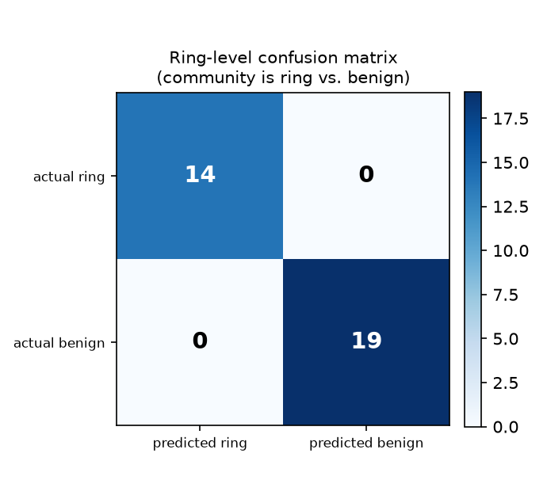
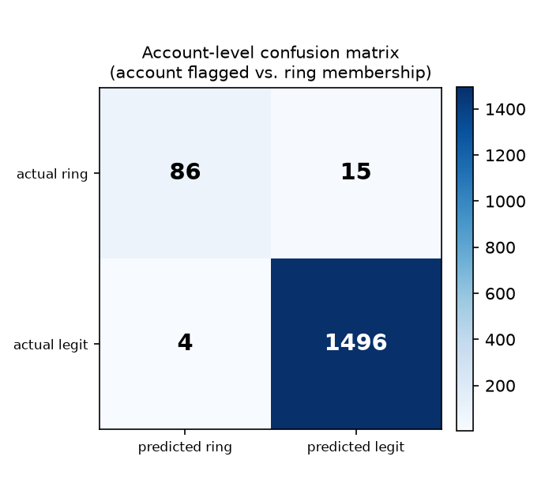
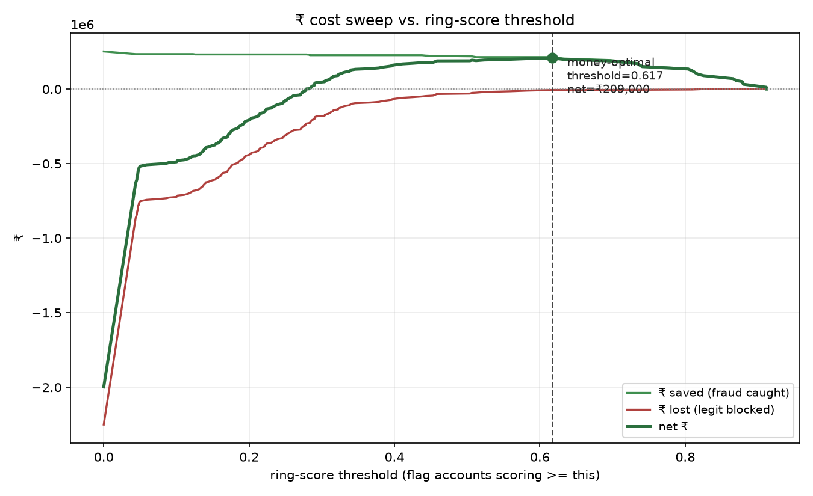
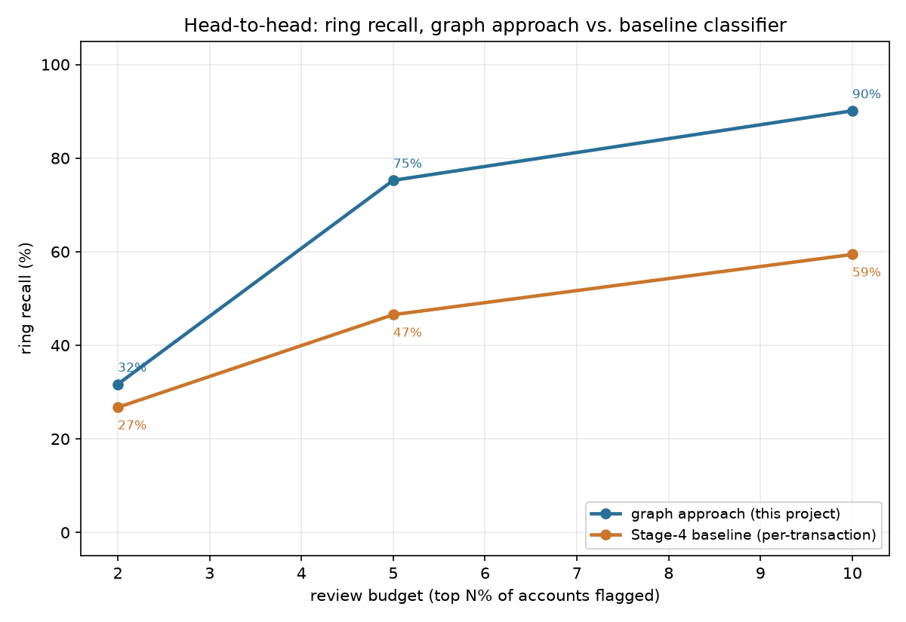

# Stage 8 — Evaluation report
Generated by `eval/run_eval.py` (`make eval`). Ground truth (`data/ground_truth.csv`, `customers.csv`'s `ring_id`/`cluster_tag`) is used **only** to score this report — it was never fed into `detect/scorer.py`'s ring-likelihood scoring itself.
## Headline numbers
- **Money-optimal ring-score threshold: 0.6170** (maximizes net ₹ across the full ₹ sweep, see below).
- At that threshold: **90 accounts flagged**, 86 of them true ring accounts, 4 of them legit accounts wrongly blocked.
- **Net ₹209,000** (₹215,000 fraud exposure caught − ₹6,000 legit-customer cost).
- **Ring-level recall: 100.0%** (14/14 pure/near-pure ring communities caught at this threshold).
- **Account-level recall: 85.1%** of all ring-member accounts flagged.
- All ring communities in the labeled universe were caught at this threshold (see the ring-level table below for the full ranking, and the “what this eval doesn't cover” section for the one ring Stage 4's community detection doesn't recover as its own community at all).

## 1. Ring-level precision / recall / F1
Universe: every size>=3 community, labeled ring (>=80% of members share one `ring_id`) or benign (majority `cluster_tag` in family/office_cluster/hostel_pg/couple). Mixed (spans multiple rings) and unlabeled communities are excluded from both sides of the count — 168 communities excluded here. This is NOT the same as recall over all 15 injected rings; see “what this eval doesn't cover” for the gap.
| | predicted ring | predicted benign |
|---|---:|---:|
| **actual ring** | TP=14 | FN=0 |
| **actual benign** | FP=0 | TN=19 |

Precision **1.000**, recall **1.000**, F1 **1.000** at threshold 0.6170.

## 2. Account-level precision / recall / F1
Universe: all 1,601 accounts. An account's score is its community's ring-likelihood score (accounts in no size>=3 community score 0 and are never flagged). Positive class = belongs to any injected ring (`ground_truth.csv label != legit`).
| | predicted ring | predicted legit |
|---|---:|---:|
| **actual ring** | TP=86 | FN=15 |
| **actual legit** | FP=4 | TN=1496 |

Precision **0.956**, recall **0.851**, F1 **0.901** at threshold 0.6170.

## 3. ₹ cost model and threshold sweep
Cost assumptions (`config.yaml`'s `cost_model`): avg order value ₹1,200, chargeback/return/cod-refusal cost ₹2,500 per ring account caught, false-block cost ₹1,500 per legit account wrongly blocked. These are rough SMB e-commerce assumptions carried over from Stage 7's agent policy model, not fitted to a real merchant's unit economics.

For every possible ring-score threshold, we flag every account scoring at or above it, then compute:
- ₹ saved = (ring accounts flagged) × chargeback_cost
- ₹ lost = (legit accounts flagged) × false_block_cost
- net ₹ = saved − lost

The **money-optimal threshold is 0.6170**, giving net ₹209,000. Below is the full sweep — note net ₹ keeps climbing as the threshold rises past the highest-scoring rings (fewer false blocks) until it runs out of true rings to catch, at which point tightening further only removes true positives and net ₹ turns flat or negative.

## 4. HEAD-TO-HEAD: graph approach vs. Stage-4 baseline classifier
The punchline. Both approaches are evaluated at the same top-N%-of-accounts review-budget operating points (not a probability threshold — see `baseline/txn_classifier.py`'s docstring for why a fixed cutoff isn't meaningful for either model).

| review budget | graph ring recall | baseline ring recall | delta |
|---:|---:|---:|---:|
| top 2% (32 accounts) | 31.7% | 26.7% | +5.0% |
| top 5% (80 accounts) | 75.2% | 46.5% | +28.7% |
| top 10% (160 accounts) | 90.1% | 59.4% | +30.7% |

The baseline classifier never sees a shared device, card, address, or community — it can only rank individually-risky-looking transactions. The graph approach can see *coordination* (the same device/card reused across many accounts, burst account creation), which is exactly what a ring is and a one-off risky individual isn't. The gap above is that difference, measured at equal review cost.

## 5. Benign look-alike clusters — false positives, reported explicitly
PLAN.md section 8's "honesty traps": large family, office/co-working IP cluster, hostel/PG pincode cluster, and card-sharing couples. None of these should be flagged on shared-attribute or size alone. At the money-optimal threshold (0.6170):

| cluster type | size | score | outcome |
|---|---:|---:|---|
| hostel_pg | 3 | 0.524 | clear (correctly not flagged) |
| family | 4 | 0.455 | clear (correctly not flagged) |
| couple | 3 | 0.390 | clear (correctly not flagged) |
| family | 4 | 0.323 | clear (correctly not flagged) |
| couple | 3 | 0.316 | clear (correctly not flagged) |
| family | 4 | 0.313 | clear (correctly not flagged) |
| couple | 3 | 0.304 | clear (correctly not flagged) |
| couple | 3 | 0.285 | clear (correctly not flagged) |
| family | 4 | 0.284 | clear (correctly not flagged) |
| couple | 3 | 0.274 | clear (correctly not flagged) |
| family | 5 | 0.252 | clear (correctly not flagged) |
| family | 4 | 0.224 | clear (correctly not flagged) |
| family | 5 | 0.222 | clear (correctly not flagged) |
| family | 7 | 0.193 | clear (correctly not flagged) |
| family | 4 | 0.187 | clear (correctly not flagged) |
| family | 4 | 0.176 | clear (correctly not flagged) |
| family | 3 | 0.118 | clear (correctly not flagged) |
| office_cluster | 6 | 0.111 | clear (correctly not flagged) |
| family | 4 | 0.059 | clear (correctly not flagged) |

All 19 benign look-alike communities cleared at this threshold — zero false positives on the honesty-trap clusters.

## 6. What this eval doesn't cover — an honest read
- **Community-detection recall gap, not scoring gap:** Stage 4's tuned resolution (`community_resolution: 0.001`) recovers 14 of 15 injected rings as their own size>=3 community — RING006's members don't cluster tightly enough at that resolution to form an identifiable community at all. That ring is **structurally absent from this eval's universe** (it can't appear in the labeled-communities table above because it never became a community), so the ring-level recall of 100.0% reported in section 1 is recall over the 14 rings Stage 4 actually surfaces, not true 15/15 recall. True full-pipeline recall (RING006 included) is 14/15 = 93.3% — worse than the headline number above, and that's the honest one to quote if asked "of all 15 rings we injected, how many did the full pipeline catch end to end." Fixing it means re-sweeping Stage 4's resolution parameter, not anything in this eval script.
- **Account-level FN (15) is larger than it looks from the ring-level table, because it's a different failure mode:** every ring in section 1's table was caught as a *community* (its members' modal community scored above threshold), but not every member of a caught ring landed inside that ring's community in the first place — a handful of individual accounts from otherwise-caught rings (and RING006 in full, per the point above) ended up in a smaller/different community that did not itself clear the threshold. This is a community-detection membership gap, not a scoring gap: those accounts' community score is whatever their actual community scored, honestly rolled up — nothing is hidden or reassigned here to inflate account-level recall.
- **Mixed/unlabeled communities are excluded, not counted as misses or false positives** — 168 such communities exist in this run. A production system would still have to make a call on them; this eval doesn't score that call either way because ground truth doesn't cleanly say what the "correct" answer is for a mixed group.
- **The ₹ cost model is illustrative, not fitted** — `avg_order_value`, `chargeback_cost`, and `false_block_cost` are the same rough SMB assumptions Stage 7's agent policy uses, not real unit economics from any merchant. The *shape* of the sweep (net ₹ rising then flattening) is the meaningful result; the absolute ₹ figures should be read as directional.
- **Synthetic data** — every number in this report is against Stage 1's generated dataset (seed 42), not real transactions. See the README's Limitations section for the broader caveat.
